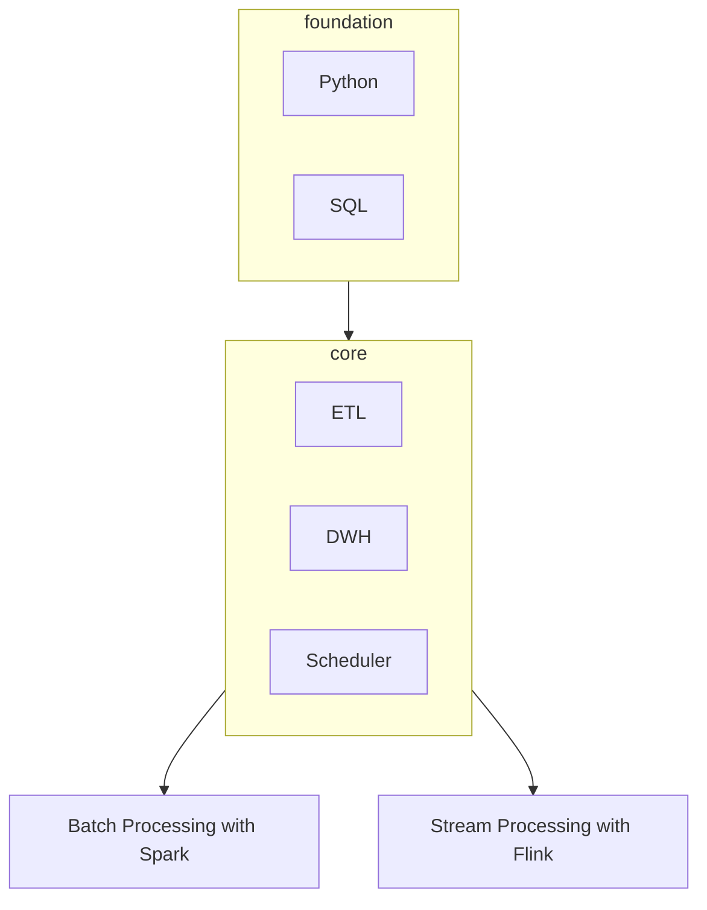

## Foundational Knowledge

### Computer Science Fundamentals

- Data Structures (Arrays, Linked Lists, HashMaps)
- Algorithms (Sorting, Searching, Recursion)
- Big O Notation

### Programming Languages

- Python (primary language for data engineering)
- SQL (essential for querying databases)
- Optional: Java/Scala for working with big data tools like Apache Spark

## Core Data Engineering Concepts

### Databases

- Relational Databases (PostgreSQL, MySQL)
- NoSQL Databases (MongoDB, Cassandra)
- Data Modeling (ER Diagrams, Normalization)
### Data Warehousing

- Concepts: ETL/ELT, Star Schema, Snowflake Schema
- Tools: Amazon Redshift, Google BigQuery, Snowflake
### Project

- Design a database schema for a simple application (e.g., an e-commerce store).
- Implement the schema in PostgreSQL or MySQL and perform CRUD operations.
- Build an ETL pipeline that loads data from CSV files into the database.
## Batch Processing

### Batch Processing Concepts
- Definition and Use Cases
- Difference between Batch and Stream Processing

### Batch Processing Frameworks
- Apache Hadoop (HDFS, MapReduce, S3)
- Apache Spark (Core Concepts, DataFrames, RDDs)
### Building Batch Data Pipelines
- Data Extraction (from databases, APIs)
- Data Transformation (using Spark, SQL)
- Data Loading (to data warehouses, data lakes)
- Schedule the ETL with Apache Airflow (workflow orchestration)
- Send into Trino (distributed SQL query engine)
### Project
 - Create a batch processing pipeline using Apache Spark that processes and transforms a large dataset (e.g., log files).
 - Use Apache Airflow to schedule and orchestrate the batch processing pipeline.
 - Load the processed data into a data warehouse like Google BigQuery or Amazon Redshift.

## Data Lakes

### Concept

- Differences between Data Lakes and Data Warehouses
- Schema-on-read vs. Schema-on-write
### Implementation

- Delta Lake (transactional storage layer on top of data lakes)
- Apache Hudi, Apache Iceberg (alternatives)
### Building

- Using Delta Lake on AWS S3 or Azure Data Lake Storage
- Managing large datasets, handling schema evolution

### Project

- Set up a data lake using Delta Lake on AWS S3.
- Ingest batch data into the data lake and manage schema evolution.
- Query the data lake using Spark SQL or Trino.

## Stream Processing

### Concepts
- Real-time Data Processing vs. Batch Processing
- Event-Driven Architectures
### Stream Processing Frameworks

- Apache Kafka (core concepts, message brokering): might mislead, Kafka is not really stream processing, but we need it.
- Apache Flink (streaming analytics)
	- Windowing
	- Checkpoint
### Building Streaming Data Pipelines

- Real-Time Data Ingestion (using Kafka)
- Stream Processing with Flink (windowing, state management)
- Real-Time Analytics and Monitoring (using Kafka Streams, Flink)
### Tools and Technologies
- Kafka Connect (data integration tool)
- KSQL (streaming SQL engine for Kafka)
### Project

- Implement a real-time data ingestion pipeline using Apache Kafka.
- Use Apache Flink to process the stream in real time, performing operations like filtering and aggregation.
- Build a real-time dashboard to visualize the streaming data.

## Data Governance

### Data Quality
- Ensuring data accuracy, completeness, and consistency
- Tools: Great Expectations, Deequ

### Data Lineage
- Tracking data flow across pipelines
- Tools: OpenLineage, DataHub
### Data Privacy
- Compliance with GDPR, CCPA, and other regulations
- Techniques for anonymization and encryption
### Data Catalogs
- Centralized metadata management
- Tools: Apache Atlas, Amundsen
### Project
- Implement data quality checks using Great Expectations in a data pipeline.
- Set up data lineage tracking with OpenLineage in your ETL pipelines.
- Create a data catalog for your data assets using Amundsen.

## Advanced Topic

### Integration of Batch and Stream Processing

- Lambda Architecture (batch and stream processing integration)
- Kappa Architecture (stream processing-centric approach)

### Performance Optimization

- Query Optimization (indexing, partitioning)
- Resource Management (YARN, Kubernetes)
- Scaling (horizontal vs vertical scaling)

### Infrastructure as Code

- Terraform (infrastructure provisioning)
- Kubernetes (container orchestration)
- Docker (containerization)

